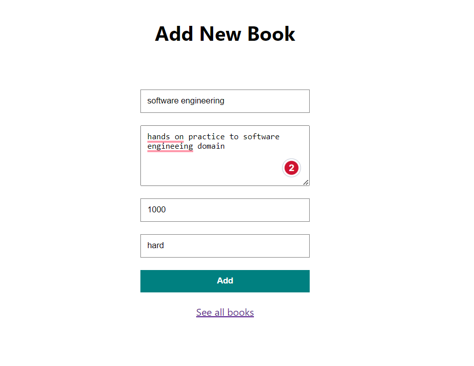
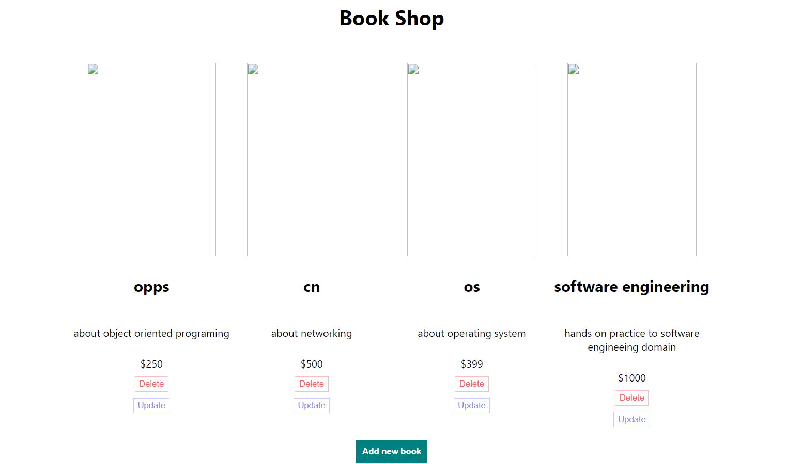

# crudOperation
React application that shows the operation related to books like add ,update , delete etc 

# overview
A book management system developed using React and SQL involves building a web application that allows users to manage books, including adding, editing, and deleting book entries. React is a popular JavaScript library for building user interfaces, while SQL (Structured Query Language) is a language used for managing relational databases.

## setting it up
1.Setup and Dependencies:
Set up a development environment with Node.js and a code editor.
Create a new React project using tools like Create React App.
Install necessary dependencies such as React Router for routing, Axios for handling HTTP requests, and any other libraries you might need.

2.DatabaseDesign:
Design the database schema to store book-related information. Identify the necessary tables, fields, and relationships.
Create the necessary tables in your SQL database management system (e.g.MySQL workbench) based on the schema design.

Backend-Development:
Build a backend server using a server-side language/framework (e.g., Node.js with Express.js) to handle API requests and interact with the database.
Implement RESTful API endpoints for book operations, such as fetching all books, adding a book, updating a book, and deleting a book.
Write SQL queries or use an ORM (Object-Relational Mapping) library to perform database operations based on the API requests.

Frontend-Development:
Create React components for different parts of the book management system, such as book list, book details, book form, etc.
Set up routing using React Router to navigate between different pages or components.
Make API requests to the backend server using Axios or a similar library to perform CRUD (Create, Read, Update, Delete) operations on books.
Implement user interface elements, such as forms for adding/editing books, and handle user interactions and validations.

Connect-Frontend-and-Backend:
Connect the frontend React application with the backend server by making HTTP requests to the API endpoints.
Ensure that the frontend and backend communicate properly and exchange data in the expected format (e.g., JSON).

Testing-and-Refinement:
Test the book management system for different scenarios, including adding, editing, and deleting books, handling errors, and validating user inputs.
Refine the system based on user feedback and fix any issues or bugs discovered during testing.

Deployment:
Deploy the backend server to a hosting platform (e.g., Heroku, AWS, Azure) and configure the necessary server environment variables.
Build the React frontend application for production and deploy it to a hosting platform or a static file hosting service (e.g., Netlify, Vercel).

